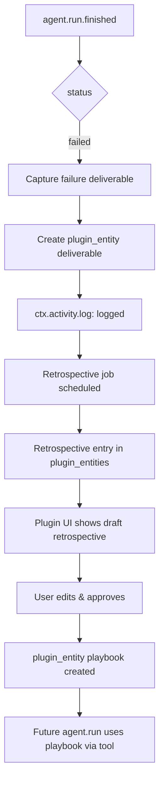

# Organizational Learning Plugin for Paperclip

**Executive Summary:** We propose an event-driven **Paperclip plugin** to capture organizational learning across agents and tasks. It will subscribe to domain events (agent runs, task updates, comments, etc.), extract learning signals, and synthesize artifacts (knowledge entries, playbooks, policies). The plugin uses Paperclip’s manifest/worker/UI surfaces: defining required *capabilities*, registering *event handlers* and *scheduled jobs*, providing *agent tools*, and offering UI extensions (detail tabs, dashboards). We store learned data in `plugin.entities` (structured DB) or `plugin.state` and surface it via a custom UI. Audit and idempotency are ensured by Paperclip’s activity log and at-least-once delivery model. The architecture leverages Paperclip’s standard extension points【57†L748-L756】【60†L1619-L1630】. Below is a comprehensive design, MVP plan, and implementation sketch.

## Plugin Architecture & Surfaces 

- **Plugin vs. Adapter/Tool:** We implement as a Paperclip *plugin* (instance-wide, out-of-process) rather than an adapter or agent tool. This is because learning spans many entities and requires UI and storage. Plugins subscribe to typed domain events, run jobs, define tools/UI, and write plugin-specific state【57†L748-L756】. (Adapters are for new agent types; tools are called during runs.) Plugins cannot override core logic (e.g. approvals)【57†L758-L769】, but we need only to react and add knowledge. 

- **Manifest:** The `manifest.ts` (as per `PaperclipPluginManifestV1`) must include `id`, `version`, `displayName`, `description`, `categories`, `capabilities`, `entrypoints.worker`, and optional `ui.slots`, `tools`, `jobs`, `webhooks`【13†L609-L618】【62†L310-L318】. For example, we might use `categories: ["automation","ui"]`. `capabilities` lists required permissions (see below). We can define `instanceConfigSchema` via Zod for plugin settings.  

- **Worker:** In `worker.ts`, we `definePlugin({ register(ctx) { ... } })`. We use `ctx.events.on(...)` to handle events, `ctx.jobs.register(...)` for schedules, `ctx.data.register`/`ctx.actions.register` for UI data/actions, and `ctx.tools.register` for agent-callable functions. This follows examples from other plugins【21†L1048-L1052】【21†L1079-L1083】. All mutating actions go through the host API (e.g. `ctx.issues.update`, `ctx.entities.upsert`) with capability checks.

- **UI:** We provide UI via React bundles. The manifest’s `ui.slots` can include pages, detail tabs, dashboard widgets, settings pages, etc. The host will mount these components in Paperclip’s UI and supply a bridge with hooks like `usePluginData` and `usePluginAction`【57†L772-L780】【18†L1218-L1226】. For example, a “Knowledge Review” tab on a task, or a “Learning Dashboard” widget on home.

- **Storage:** We store plugin data either in `ctx.state` (key/value) or the `plugin_entities` table【60†L1619-L1630】. For structured records (e.g. learning artifacts, scorecards) we recommend `plugin_entities` (entity_type scoping) for querying. Primitive per-issue flags can go in `ctx.state`. All secrets/config go through host secrets.

- **Audit:** All plugin actions that mutate data must log to the activity log (`ctx.activity.log.write`) with `actor_type = plugin`【60†L1648-L1656】. We rely on at-least-once delivery and idempotent handlers (check for existing state) to handle duplicates.

## Learning Goals & Axes

We target these organizational learning dimensions:

- **Knowledge Capture:** Automatically harvest information from *agent runs, issue descriptions, comments, review notes*, etc. (e.g. lessons from failures or solutions).  
- **Synthesis:** Combine captured data into structured artifacts: **playbooks**, **templates**, **FAQs**, **policy rules** (e.g. how to handle a type of request), **embeddings** for semantic search.  
- **Feedback Loops:** Continuously evaluate agent outputs against success metrics (e.g. task completion rates, quality scores). Generate *alerts* or *retry tasks* if needed.  
- **Metrics & Scorecards:** Define KPIs (e.g. code review turnaround, doc quality). Track them as *scorecards*, compare over time, and visualize on a dashboard.  
- **Retention:** Store knowledge so future agents/humans can reuse it: e.g. a corporate wiki of solutions or a vector database of answers.  
- **Onboarding:** Use the captured knowledge to train or instruct new agents (e.g. loading policies into agent context).  
- **Policy/Rule Extraction:** Infer formal rules from data (e.g. if an agent repeatedly errs on X, create a new guardrail policy).  
- **Retrospectives:** After major milestones (goal completion), automatically generate a post-mortem report summarizing what went well or what knowledge was gained.  
- **Continuous Improvement:** Iterate on goals/strategies. E.g. if an AI marketer’s output is off-target, feedback this into retraining or updated instructions.

Each of these axes maps to plugin features: e.g. capturing comes from event handlers; synthesis uses jobs or agent tools; metrics are stored/counted in state; retrospectives could be a scheduled job triggering a summarization agent run.

## Data Sources & Detection Triggers

We subscribe to Paperclip events and webhooks to detect learning opportunities:

- **Agent Runs:** `agent.run.finished` (or `.failed`) events【18†L1102-L1105】. E.g. a developer agent finishes writing code – we capture the outcome and log it as a deliverable.  
- **Task Issues:** `issue.created`, `issue.updated`, `issue.comment.created`. Agents express themselves via tasks and comments, so we capture new information or corrections from these. (The `issue.updated` payload is partial【52†L225-L233】, so we may fetch full details with `ctx.issues` API if needed.)  
- **Assets:** If we use attachments or docs, monitor `asset.created` (if such events exist) or include assets in issue comments.  
- **Approvals:** `approval.created`, `approval.decided` events【18†L1107-L1110】 can indicate governance decisions or strategy approvals to learn from.  
- **External Webhooks:** We can define plugin webhooks (in manifest) to receive signals, e.g. from Slack notifications, GitHub events, or email gateways. The worker’s `handleWebhook` can ingest these.  
- **Scheduled Jobs:** Some learning might not be event-driven. For example, daily aggregation, periodic review tasks (ctx.jobs.register with cron) can trigger summarization jobs.  
- **Manual/Agent Tools:** Provide explicit tools like `recordKnowledge`, `submitPostmortem`, etc. An agent could call `ctx.tools.register("record-knowledge", ...)` during a run to flag something as important. Humans could also invoke plugin actions via UI to tag learnable items.

**Capabilities needed:** `events.subscribe`, `jobs.schedule`, `webhooks.receive` for these triggers, plus data access (`issues.read`, `issue.comments.read`, etc.), external calls (`http.outbound` for external APIs)【32†L1045-L1053】.

## Learning Artifacts & Storage

We generate and persist various artifacts:

- **Knowledge Base Entries:** Structured records (e.g. Q&A, how-tos). Stored as plugin entities `entity_type = "knowledge_entry"`, with `data_json` holding title/content.  
- **Templates/Playbooks:** Predefined task templates. E.g. an agent run might create an `entity_type = "playbook"` linking to a list of step templates.  
- **Policies/Rules:** Formal rules derived from data. Could store as `entity_type = "policy"`, with fields like `rule_condition`, `action`.  
- **Embeddings:** If using semantic search, we might call an embedding service and store vectors externally; plugin could store references in `plugin.entities` or an external vector DB (not directly managed by plugin).  
- **Scorecards:** Define metrics per goal or team. We can store current/target values in a table (e.g. `entity_type = "scorecard"` or a separate plugin_state key).  
- **Retrospectives:** `entity_type = "retrospective"` records summarizing post-mortems with key insights.

For storage, **Plugin State** (`ctx.state`) is simple KV (good for flags or small JSON per scope). **Plugin Entities** is a full table (structured records)【60†L1619-L1630】. We will use `plugin_entities` for all record types above, with columns as per spec (id, plugin_id, entity_type, scope, data_json)【60†L1619-L1630】. This allows indexing and querying of our learning artifacts. Non-structured config (thresholds, mappings) can be `ctx.config` or `ctx.state`.

### Example Schema (Markdown Tables)

We propose tables based on `plugin_entities` (id, plugin_id, entity_type, etc.):

#### Deliverables Table (`entity_type = "deliverable"`)  

| Column        | Type    | Description |
|---------------|---------|-------------|
| id            | uuid    | Unique record ID |
| plugin_id     | uuid    | This plugin’s ID |
| entity_type   | text    | `"deliverable"` |
| scope_kind    | enum    | `"issue"` or `"run"` |
| scope_id      | uuid    | ID of the related issue or run |
| external_id   | text    | Optional external ref (e.g. Slack thread) |
| title         | text    | Short description of deliverable |
| status        | text    | e.g. `"pending_review"`, `"approved"`, `"rejected"` |
| data_json     | jsonb   | Detailed info (score, feedback list, attachments) |
| created_at    | timestamp | When recorded |
| updated_at    | timestamp | Last update time |

#### Learning Artifacts Table (`entity_type = "knowledge_entry"/"policy"/"playbook"`)  

| Column        | Type    | Description |
|---------------|---------|-------------|
| id            | uuid    | Unique record ID |
| plugin_id     | uuid    | This plugin’s ID |
| entity_type   | text    | e.g. `"knowledge_entry"`, `"policy"`, `"playbook"` |
| scope_kind    | text    | Context (e.g. `"company"`, or related issue) |
| scope_id      | uuid    | ID for scope (e.g. company ID) |
| external_id   | text    | Optional source ref (e.g. source document) |
| title         | text    | Name or summary |
| status        | text    | (e.g. `"active"`, `"draft"`) |
| data_json     | jsonb   | Content/details (text body, steps, rules) |
| created_at    | timestamp | Creation time |
| updated_at    | timestamp | Last modified |

#### Scorecards Table (`entity_type = "scorecard"`)  

| Column      | Type    | Description |
|-------------|---------|-------------|
| id          | uuid    | Unique scorecard ID |
| plugin_id   | uuid    | This plugin’s ID |
| entity_type | text    | `"scorecard"` |
| scope_kind  | text    | e.g. `"company"` or `"project"` |
| scope_id    | uuid    | ID of scope (company/project) |
| external_id | text    | e.g. metric name or goal ID |
| title       | text    | e.g. `"Retrospective Quality"` |
| status      | text    | (optional) |
| data_json   | jsonb   | { current: number, target: number, history: [ ... ] } |
| created_at  | timestamp | Created time |
| updated_at  | timestamp | Last updated |

#### Audit Log Table (`entity_type = "audit"`)  

We rely primarily on Paperclip’s activity log for audit【60†L1648-L1656】. However, plugins can log within `data_json` or use a separate `audit` type:

| Column      | Type    | Description |
|-------------|---------|-------------|
| id          | uuid    | Unique ID |
| plugin_id   | uuid    | This plugin’s ID |
| entity_type | text    | `"audit"` |
| scope_kind  | text    | e.g. `"issue"` |
| scope_id    | uuid    | Related record ID |
| external_id | text    | (optional context) |
| title       | text    | (e.g. `"Quality Check Logged"`) |
| status      | text    | (optional) |
| data_json   | jsonb   | { action: "approved", user: "Alice", note: "...", timestamp: "..." } |
| created_at  | timestamp | When occurred |

*(These schemas assume we use `plugin_entities`. If we used `ctx.state`, records would be per-key instead.)*

## Events & Capabilities

We subscribe to Paperclip core events and plugin-emitted events. Key events include:

- **Task/Issue Events:**  
  - `issue.created/updated` (catch new tasks or status changes)  
  - `issue.comment.created` (new discussion, often agent feedback)  
  - *“Heartbeat” Events:* e.g. `goal.completed`, if available, to trigger retrospectives.

- **Agent Run Events:**  
  - `agent.run.started/finished/failed/cancelled`【18†L1102-L1105】. We focus on `finished` to process completed work. The payload includes `runId`, `agentId`, `projectId`, etc., which we can use to fetch run logs or results.  

- **Approval Events:**  
  - `approval.created/decided`【18†L1107-L1110】. Agents often use approvals for hiring or strategy; we can learn from these decisions.

- **Custom/Plugin Events:**  
  - We may emit and subscribe to `plugin.<pluginId>.*` events for internal coordination (e.g. `plugin.learning.reviewed`).

- **Webhooks:**  
  - Plugin may receive webhooks from external systems (Slack posts, GitHub issues/comments, etc.) if configured in `manifest.webhooks`. For example, a GitHub webhook could feed into the learning loop.

- **Scheduled Jobs:**  
  - Define cron jobs (`ctx.jobs.register`) for periodic tasks: e.g., nightly summary, weekly retrospective prompts, quarterly metric rollups.

**Capabilities required:**  
We declare these in the manifest:

- `events.subscribe` – to receive events【32†L1045-L1053】.  
- `issues.read`, `issues.update`, `issue.comments.read/create` – to inspect and post updates to tasks (for status changes, comments)【32†L1029-L1036】.  
- `agents.read`, `agents.update` – if modifying agent schedules or asking new tasks.  
- `goals.read/update` – if writing retrospective summaries as goals.  
- `plugin.entities.upsert`/`list` (via `ctx.entities`) – for `plugin_entities` access. (Note: This is not listed in capabilities but is assumed allowed for plugin state.)  
- `plugin.state.read/write` – for simple state flags.  
- `events.emit` – if we broadcast custom events (granted by default with subscribe).  
- `jobs.schedule` – to register scheduled jobs.  
- `webhooks.receive` – to define inbound webhooks.  
- `http.outbound` – to call external APIs (e.g. GPT, embedding service).  
- `agent.tools.register` – to contribute any tools agents use (e.g. lookup knowledge).  
- UI caps: `ui.detailTab.register`, `ui.page.register`, `ui.dashboardWidget.register`, etc., for each UI slot【13†L631-L642】【57†L772-L780】.  
- `instance.settings.register` – if adding settings pages.  
- Any **data write** caps needed for external systems (e.g. if writing to issues in an external repo via webhook).

We **avoid** forbidden caps【32†L1067-L1075】: we do *not* try to mutate approvals or skip budget rules.

## Event Flow Diagram

Here is a representative flow (Mermaid) for one axis – **Post-Mortem → Playbook Creation → Enforcement**:

```mermaid
flowchart LR
    A[Agent.run.finished (error)] --> B[Plugin: Capture Error & Trigger Review]
    B --> C[Schedule retrospective job / or manual trigger]
    C --> D[ctx.tools: use AI to generate Postmortem notes]
    D --> E[ctx.entities: store Retrospective (with key findings)]
    E --> F[Plugin UI: Prompt board to create Playbook]
    F --> G[Board approves playbook draft]
    G --> H[ctx.entities: create Playbook record]
    H --> I[Agent tool: retrieve Playbook during similar tasks]
    I --> J[Future Agent.run checks Playbook => improved outcome]

    click H href "https://example.com#playbook_creation" "Playbook record"
```

This diagram shows how an error triggers retrospection, capturing knowledge, and producing a reusable playbook, which then influences future runs.

## Representative Lifecycle: Retrospective Learning

1. **Detect Completion:** When a goal or sprint ends, trigger `goal.completed` or via scheduled job. (Alternatively, an agent calls `ctx.emit("plugin.learning.triggerRetrospective")`.)
2. **Generate Postmortem:** Plugin runs a job invoking an LLM tool (`ctx.tools.register("summarize",...)`) on all issue comments / run logs. The output is a draft retrospective report.
3. **Review & Refine:** The report is stored (`plugin_entities`, type=`retrospective`) and surfaced in a UI page/tab for a human (or board) to review. They can edit/add insights.
4. **Create Playbook:** Based on finalized retro, plugin suggests new playbook steps. For example, if many bugs occurred, create a "QA Checklist" playbook (entity_type=`playbook`). The board can approve it via UI action.
5. **Store & Deploy:** On approval, the playbook (JSON content in `data_json`) is saved. The plugin may then add a snippet to agent prompts (via agent tool or UI to attach to future tasks).
6. **Enforcement:** For future tasks, agents query the playbook (e.g. `ctx.tools.register("get-playbook", ...)`), integrating it into their workflow. The plugin may also auto-close retrospectives as done and log everything.

## UI Entry Points & Mockups

We expose the following UI slots (in manifest):

- **Issue Detail Tab:** e.g. `id: "retro-tab", entityTypes: ["issue"]`, component `RetroTab`. Shows playbook suggestions, allows actions on that task.  
- **Goal Detail Tab:** For overall retrospectives per goal.  
- **Dashboard Widget:** e.g. `LearningDashboardWidget` on company home page to visualize key metrics and pending learnings.  
- **Settings Page:** Under plugin settings, a form to configure thresholds or webhook URLs (auto-generated from `instanceConfigSchema`)【21†L1023-L1030】.  
- **Company Plugin Page:** A main page at `/:company/plugins/our-learning-plugin`【60†L1723-L1731】 listing all learnings, artifacts, scorecards, etc.  

**Example JSX component (Issue Detail Tab):**

```jsx
import { usePluginData, usePluginAction } from "@paperclipai/plugin-sdk/ui";
function RetrospectiveTab({ context }) {
  const { data: retro, loading } = usePluginData("getRetrospective", { issueId: context.issueId });
  const finalize = usePluginAction("finalizeRetrospective");
  if (loading) return <Spinner />;
  return (
    <div>
      <h3>Retrospective Notes</h3>
      <MarkdownEditor content={retro.notes} disabled={!retro.editable} />
      <button onClick={() => finalize({ issueId: context.issueId })}>Mark Complete</button>
    </div>
  );
}
```
This pseudocode shows using `usePluginData` to fetch retrospective data and `usePluginAction` to finalize it. Actual implementation would include form fields, lists of artifacts, etc. (We assume basic components like `MarkdownEditor` from the SDK).

## Worker Logic (TypeScript Pseudocode)

```ts
export default definePlugin({
  id: "org-learning",
  version: "0.1.0",
  displayName: "Org Learning",
  categories: ["automation", "ui"],
  capabilities: [
    "events.subscribe", "issues.read","issues.update","issue.comments.read","issue.comments.create",
    "agents.read","goals.read","data.read","data.write","costs.read","activity.log.write",
    "plugin.state.read","plugin.state.write",
    "ui.detailTab.register", "ui.dashboardWidget.register", "instance.settings.register",
    "jobs.schedule", "webhooks.receive", "http.outbound", "agent.tools.register"
  ],
  entrypoints: { worker: "./dist/worker.js", ui: "./dist/ui" },
  async register(ctx) {
    // Example: detect agent run failures
    ctx.events.on("agent.run.finished", async (event) => {
      const { runId, agentId, status } = event.payload;
      if (status === "failed") {
        // Record a deliverable for retrospective
        const record = { runId, agentId, error: "See run logs", status: "pending_review" };
        await ctx.entities.upsert({
          pluginId: ctx.manifest.id,
          entityType: "deliverable",
          scopeKind: "run", scopeId: runId,
          externalId: null, title: `Run ${runId} failure`,
          status: "pending_review", dataJson: record
        });
        ctx.activity.log.write({ actor_type: "plugin", actor_id: ctx.manifest.id, message: `Captured run ${runId} failure for review` });
      }
    });

    // Scheduled job: weekly retrospective
    ctx.jobs.register("weekly-retrospective", { cron: "0 0 * * MON" }, async () => {
      const retros = await ctx.tools.execute("summarize-runs", {});
      // Save retrospective artifact
      await ctx.entities.upsert({
        pluginId: ctx.manifest.id,
        entityType: "retrospective",
        scopeKind: "company", scopeId: event.companyId,
        title: `Weekly Retrospective ${new Date().toISOString().slice(0,10)}`,
        status: "draft", dataJson: { notes: retros }
      });
    });

    // UI Data: get retrospective by issue (or company context)
    ctx.data.register("getRetrospective", async ({ issueId }) => {
      // find retrospective linked to this issue or company
      const list = await ctx.entities.list({ pluginId: ctx.manifest.id, entityType: "retrospective", scopeId: issueId });
      return list[0]?.dataJson || { notes: "", editable: true };
    });

    // UI Action: finalize retrospective
    ctx.actions.register("finalizeRetrospective", async ({ issueId }) => {
      const key = { pluginId: ctx.manifest.id, entityType: "retrospective", scopeKind:"issue", scopeId: issueId };
      await ctx.entities.upsert({ ...key, status: "completed" });
      ctx.activity.log.write({ actor_type: "plugin", actor_id: ctx.manifest.id, message: `Retrospective for issue ${issueId} completed` });
    });

    // Agent Tool: query playbooks
    ctx.tools.register("get-playbooks", { displayName: "Get Playbooks", description: "Fetch relevant playbooks", parametersSchema: {} }, async (params, runCtx) => {
      const playbooks = await ctx.entities.list({ pluginId: ctx.manifest.id, entityType: "playbook", scopeKind:"company", scopeId: runCtx.companyId });
      return { content: JSON.stringify(playbooks.map(p => p.dataJson)) };
    });
  }
});
```

This pseudocode illustrates handlers for events, jobs, data/actions, and tools. It records failures as `deliverable` entities, schedules a job to create a `retrospective`, and provides UI integration. All data writes use the SDK (`ctx.entities`, `ctx.activities`, etc.). We log actions with `actor_type = plugin`.

## Event Flow Diagram (Mermaid)



## Implementation & MVP Plan

1. **Setup:** Use `@paperclipai/plugin-sdk`. Scaffold via `definePlugin`. Use `create-paperclip-plugin` (if available) to initialize boilerplate.  
2. **Manifest:** As outlined above, fill in `id`, `version`, `capabilities`, `tools`, `webhooks` (if needed), `slots`. E.g. `webhooks: [{ key: "slack", path: "/slack" }]` to receive Slack callbacks. Include `tools` for any agent API.  
3. **Worker Code:** Implement handlers for a subset of axes: e.g. detection of deliverables (`agent.run.finished`), a `ctx.jobs.register` for retrospectives, and `ctx.actions.register` for finalizing. Use `ctx.entities` to store structured data.  
4. **UI Code:** Add React components. For MVP, create a detail tab for tasks (e.g. showing review status and actions) and a dashboard widget (showing number of pending reviews, learnings summary). Use `usePluginData`/`usePluginAction` hooks to connect with worker.  
5. **Local Dev/Test:** Use `@paperclipai/plugin-test-harness` (when available) to simulate events. Write unit tests emitting synthetic events and verifying `ctx.state` or `ctx.entities` changes【21†L1079-L1083】. Run a local Paperclip instance (Docker) and load the plugin.  
6. **MVP Scope (Prioritized):**  
   - **Phase 1:** Detect deliverables (from `agent.run.finished`), store in plugin state, block tasks, simple UI with approve/reject.  
   - **Phase 2:** Add feedback loop: scheduled job to aggregate metrics, UI for dashboards/scorecards.  
   - **Phase 3:** Knowledge artifacts: allow creation of knowledge entries and playbooks with board review. Add agent tool for querying knowledge.  
   - **Phase 4:** External integration: webhooks (e.g. Slack notifications) and advanced embeddings search.

7. **Observability:** Use `ctx.activity.log.write` for each action. Expose metrics (e.g. number of reviews done) via host metrics.  
8. **Concurrency/Idempotency:** Use filters on events (by projectId/companyId) to limit scope. In handlers, check if an entity already exists before upserting to avoid duplicates. Leverage host job deduplication (no overlapping jobs)【18†L1166-L1170】.

### Local Dev/Test Setup

- **Plugin Test Harness:** A mock host to test `register(ctx)` logic without a full Paperclip instance. Emit synthetic events: 
  ```js
  await harness.emit("agent.run.finished", { runId: "r1", agentId: "a1", status: "failed", projectId: "p1", companyId: "c1" });
  ```
  Then inspect `harness.getState(scope)` or `harness.entities.list(...)`.  
- **Local Paperclip Instance:** Follow Paperclip local deployment docs. Enable plugin runtime. Use CLI `pnpm paperclipai plugin install` to load the plugin code (built via `npm run build`).  
- **Iterate:** Edit code, rebuild, and hot-reload plugin (supported by system【60†L1784-L1793】). Use sample company and agents to simulate runs and verify UI/DB changes.

## References and Sources

This design is grounded in Paperclip’s plugin architecture【13†L609-L618】【60†L1619-L1630】. We employ event subscriptions, state storage, and UI slots as specified in the Paperclip Plugin Spec【57†L748-L756】【32†L1045-L1053】. The sample flows and manifest fields mirror existing plugins (e.g. GitHub sync plugin【62†L310-L318】). All data writes go through the Paperclip SDK (`ctx.*`), ensuring governance and audit (plugin actor logging)【60†L1648-L1656】. Detailed internals (event payloads, DB schema) are taken from the Paperclip docs cited above. Any unspecified behaviors (like exact LLM calls) are noted as assumptions.

